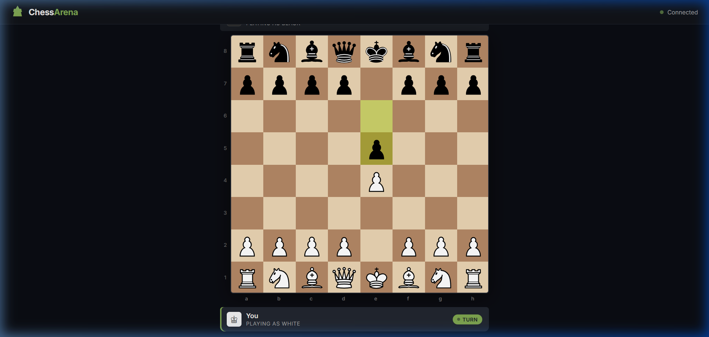
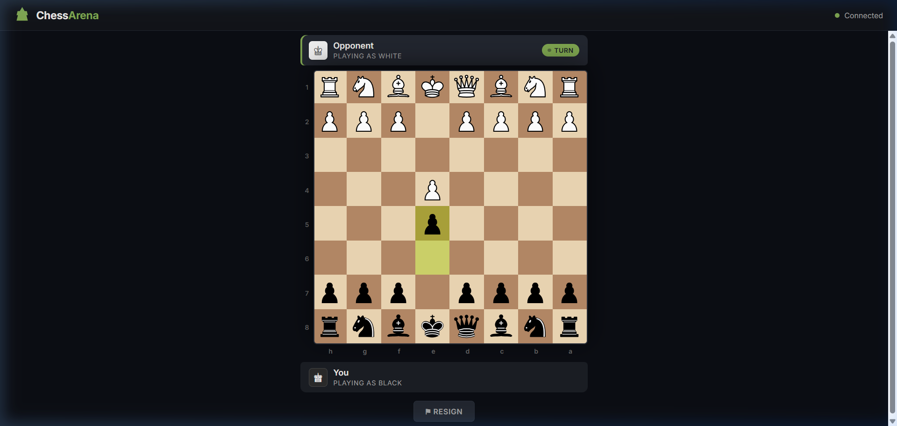

# ♟️ ChessArena — Real-Time Multiplayer Chess Platform

A polished, production-quality, real-time multiplayer chess platform built with **Node.js**, **Express**, **Socket.IO**, and **Chess.js**. Features server-authoritative move validation, professional SVG pieces, move highlighting, sound effects, game-over detection, and a modern dark-themed UI.

> **This is not a demo** — it's designed to feel like a real product.

---

## 📸 Screenshots

<p align="center">
  
</p>
<p align="center"><em>White player's perspective — SVG pieces, last-move highlighting, turn indicator</em></p>

<br>

<p align="center">
  
</p>
<p align="center"><em>Black player's perspective — board auto-flips, rank/file labels adapt</em></p>

---

## 🚀 Features

### 🎮 Gameplay & Chess Mechanics
- **Full Chess Rules Engine** — Powered by `chess.js` on both client and server
- **Server-Side Move Validation** — All moves validated server-side to prevent cheating (server remains ultimate authority)
- **Phase 2 Legal Move Experience** — Complete dynamic visual feedback powered by `chess.js`:
  - **Selected Piece:** High-contrast illuminated square highlight with subtle inner glow
  - **Legal Empty Destinations:** Subtle circular dots with interactive hover scaling
  - **Legal Captures:** High-visibility capture rings framing enemy pieces (handles standard captures & en passant)
  - **Comprehensive Rules Respect:** Full support for Turn, Check, Checkmate, Absolute Pins, King Safety, Castling (O-O / O-O-O), En Passant, and Pawn Promotion
  - **Intuitive Interaction Flow:** Click to select, click again to deselect, click another own piece to switch selection instantly, click legal target to move, click illegal square for subtle feedback
- **Phase 3 Professional Chess Clocks** — Full server-authoritative time controls:
  - **Supported Formats:** `1+0`, `2+1` (Bullet), `3+0`, `3+2`, `5+0` (Blitz), `10+0`, `10+5`, `15+10` (Rapid), `30+0` (Classical)
  - **Immediate Turn Switching:** Clock switches immediately after each legal move with zero delay
  - **Server-Authoritative Timing:** High-precision millisecond tracking prevents client tampering or timer cheating
  - **Accurate Timeout Detection:** Server-side 100ms interval detects exact timeouts and awards wins or FIDE Article 6.9 insufficient material draws
  - **Move Increments:** Automatic addition of increment seconds (e.g. +1s, +2s, +5s, +10s) on move completion with floating badge animation
  - **Multi-Stage Low-Time Warnings:** Visual amber pulse (`< 30s`) and critical red glowing alert (`< 10s`)
  - **Sub-Second Precision Display:** Millisecond tenths display (`0:09.4`) under 20 seconds
  - **Disconnect / Reconnect Persistence:** Full clock snapshot synchronized immediately upon reconnecting
- **Pawn Promotion** — Automatic queen promotion on reaching the opposite rank
- **Game-Over Detection** — Checkmate, stalemate, timeout, resignation, threefold repetition, insufficient material, 50-move rule
- **Draw Offers** — In-game draw offer protocol with mutual consent confirmation
- **Resign & Quick Reset** — Clean surrender mechanics with confirmation modals
- **Board Flip** — On-demand perspective toggle for analysis or spectator convenience

### 🌐 Real-Time Multiplayer & Social
- **WebSocket Architecture** — Instant synchronization via Socket.IO
- **Live In-Game Chat** — Real-time communication channel with role badges and system activity logs
- **Dynamic Role Assignment** — 1st player = White, 2nd = Black, 3rd+ = Spectators
- **Player Disconnect Handling** — Seats freed automatically on disconnect with chat announcements
- **Live Board Sync** — Spectators and reconnecting players receive current game state and move history immediately

### 🎨 Professional UI & Complete Layout
- **Brand Navbar** — Platform header featuring Play, Puzzles, Learn, Watch, and User Profile menu with rating badges
- **Dual Player Strips** — Opponent & Player cards with avatars, ratings, online indicators, and active turn pulses
- **Live Chess Clocks** — High-legibility monospaced digital timers with active glowing states
- **Material Evaluation & Captured Trays** — Visual trays of captured pieces with real-time material lead calculations (+1, +2, etc.)
- **Algebraic Move Notation Panel** — Two-column moves table (`#`, `White`, `Black`) with active-move highlighting and auto-scroll
- **Action Control Toolbar** — Integrated Draw, Resign, Flip, and New Game controls
- **SVG Chess Pieces** — High-quality cburnett piece set with smooth drag-and-drop & click-to-move
- **Highlights & Indicators** — Last-move highlight, check glow, legal move dots, and capture target rings
- **Sound Effects & Haptics** — Move, capture, and notification audio feedback
- **Responsive Layout** — Desktop 2-column split with responsive folding for smaller screens

---

## 🛠️ Tech Stack

| Layer | Technology |
|-------|-----------|
| **Server** | Node.js, Express.js 5.x |
| **Real-time** | Socket.IO 4.8 |
| **Game Engine** | chess.js 1.4 (same version on client and server) |
| **Templating** | EJS |
| **Frontend** | Vanilla JavaScript (ES6+), HTML5 Drag & Drop API |
| **Styling** | Custom CSS design system (Inter font, CSS custom properties) |
| **Assets** | cburnett SVG pieces, Lichess sound effects |

---

## 📁 Project Structure

```
ChessArena/
├── public/
│   ├── css/
│   │   └── styles.css          # Design system — tokens, board, layout, modal, responsive
│   ├── img/
│   │   └── pieces/             # 12 SVG chess pieces (wP, wR, wN, wB, wQ, wK, bP, bR, bN, bB, bQ, bK)
│   ├── js/
│   │   ├── chess-shim.js       # CJS-to-browser shim for chess.js
│   │   └── chessgame.js        # Client game engine — rendering, input, sockets, sounds, UI
│   └── sounds/
│       ├── Move.mp3            # Piece movement sound
│       ├── Capture.mp3         # Piece capture sound
│       └── GenericNotify.mp3   # Game event notification sound
├── views/
│   └── index.ejs               # Main page — header, player bars, board, controls, modal
├── screenshots/
│   ├── board-white.png         # White player perspective screenshot
│   └── gameplay.png            # Black player perspective screenshot
├── app.js                      # Express server — Socket.IO events, game state, validation
├── package.json                # Dependencies and scripts
└── README.md
```

---

## ⚡ Getting Started

### Prerequisites
- [Node.js](https://nodejs.org/) v16 or higher

### Installation
```bash
git clone https://github.com/Hexecutionerr/multiplayer-chess-game.git
cd multiplayer-chess-game
npm install
```

### Run
```bash
# Production
npm start

# Development (auto-reload with nodemon)
npm run dev
```

### Play
Open your browser at **[http://localhost:3000](http://localhost:3000)**

> **Multiplayer Testing:**
> 1. Open `localhost:3000` in a browser tab → Joins as **White**
> 2. Open `localhost:3000` in incognito / separate browser → Joins as **Black**
> 3. Any additional tab → Joins as **Spectator**

---

## 🔌 Socket.IO Event Architecture

```
Client → Server              Server → Client
─────────────────            ─────────────────
move {from, to, promotion}   playerRole ("w"/"b")
resign                       spectatorRole
newGame                      gameState {fen, turn, isCheck, history}
                             boardState (FEN string)
                             move {from, to, san, captured, isCheck}
                             invalidMove
                             gameOver {type, winner, message}
                             newGame {fen, turn, ...}
```

---

## 🗺️ Roadmap

| Phase | Features | Status |
|-------|----------|--------|
| **Phase 1** | Professional UI, Complete Desktop Layout (Navbar, Clocks, Moves, Captured, Chat, Controls) | ✅ Complete |
| **Phase 2** | Chess Move Experience (Dynamic Legal Moves, Selection Switching, Dots, Rings, Pins, Castling, En Passant) | ✅ Complete |
| **Phase 3** | Professional Chess Clocks (1+0 to 30+0, Increments, Server Authority, Anti-Cheat, Sub-Second Decimals, Timeout Detection) | ✅ Complete |
| **Phase 4** | Game rooms, lobby, authentication, matchmaking, private games | 🔜 Planned |
| **Phase 5** | ELO ratings, leaderboards, game history, player profiles | 📋 Planned |
| **Phase 6** | AI opponent (Stockfish), game review, analysis board | 📋 Planned |

---

## 👨‍💻 Author

**Hasnain Khan**  
*Lead Developer & Architect*

- [GitHub](https://github.com/Hexecutionerr)
- [LinkedIn](https://www.linkedin.com/in/hasnain-khan-0ab3b2320)
